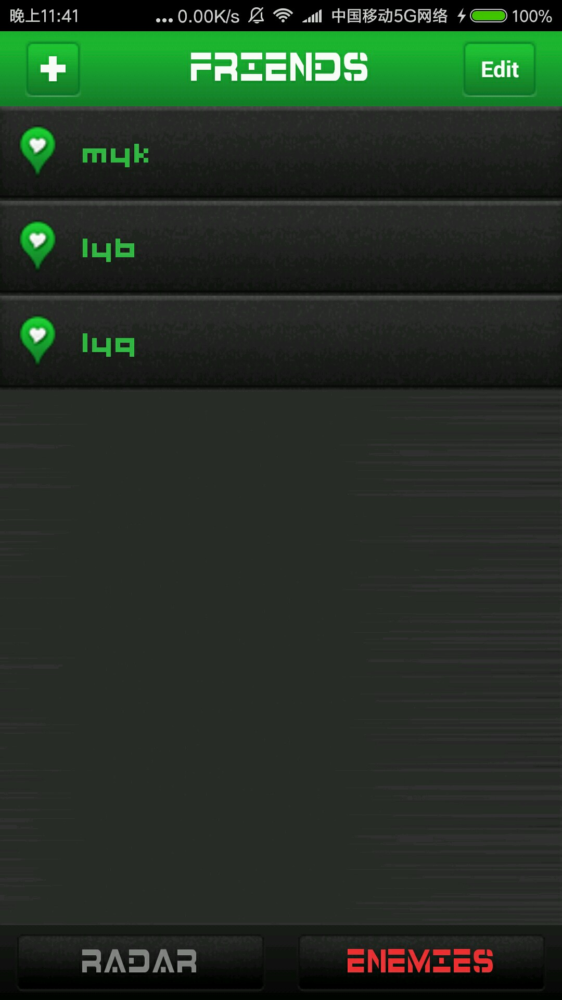

# MyRadar
>Imitate the app Radar.

##实现了：

* 打开应用进行定位，显示以自己为中心的baidu地图
* 地图上显示好友/敌人坐标点、与自己位置的连线、连线上显示距离
* 点击刷新按钮，发送一条“where are you?"短信给好友和敌人
* 监听短信并进行对应处理
* 使用反向地理编码获取地理位置信息
* 启动和点击刷新按钮时的雷达扫描动画
* 短信通信之间使用AES加密算法进行加密
* 自动删除多余短信

##应用截图

 

 
